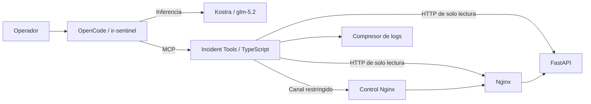
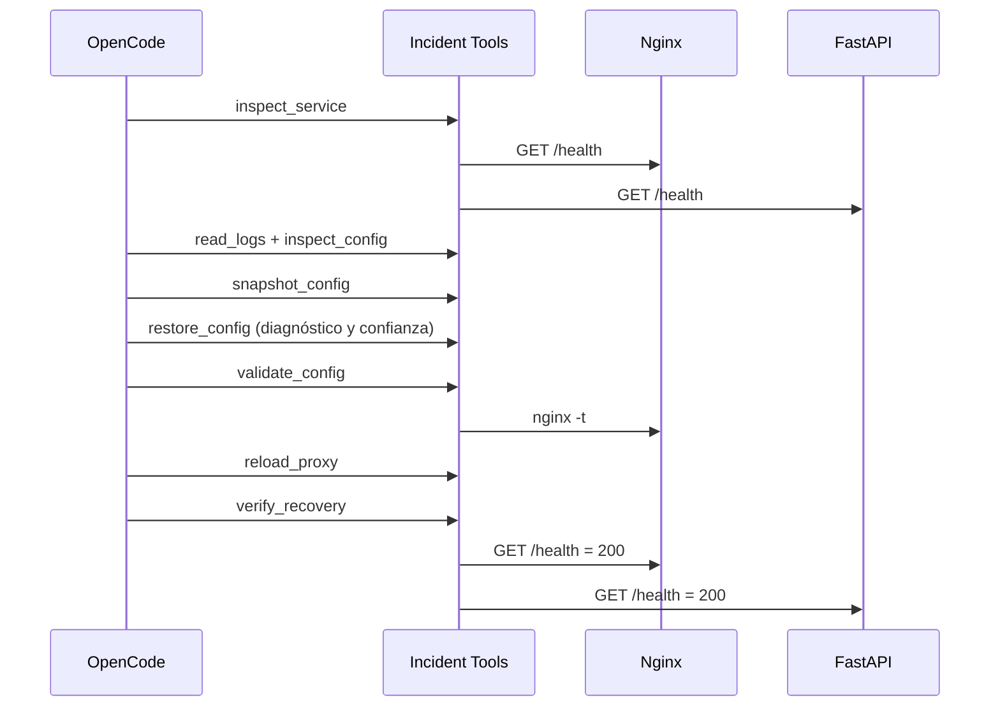

# Arquitectura del MVP `api502`

## Objetivo

Demostrar que OpenCode, usando Kostra y `glm-5.2`, puede diagnosticar y recuperar
de forma autónoma una API que entrega `502 Bad Gateway` por un upstream incorrecto
en Nginx. La API permanece saludable durante el incidente.

## Componentes implementados

| Componente | Responsabilidad | Tecnología |
|---|---|---|
| API afectada | Endpoint `/health` que continúa sano | Python 3.12, FastAPI |
| Gateway | Punto de acceso que puede quedar mal configurado | Nginx 1.29 |
| Incident Tools | Evidencia, política de recuperación, ocho herramientas MCP y Dashboard web | Node.js 22, TypeScript 6, pnpm 11 |
| Agente | Decide el flujo y explica evidencia, riesgo y resultado | OpenCode 1.18, Kostra, GLM-5.2 |
| Entorno | Aislamiento y red reproducibles | Docker Compose, Linux |

El único endpoint del servicio afectado publicado al host es Nginx en
`127.0.0.1:8088`. La API no publica puertos. El servidor operativo se publica
localmente en `127.0.0.1:3001` (Dashboard web en `/` y `/dashboard`, y MCP SSE en `/mcp`)
para que el operador y OpenCode puedan interactuar.

## Controles que no dependen del modelo

- La configuración se respalda antes de restaurarla.
- El respaldo debe pertenecer al mismo incidente.
- La recuperación requiere confianza entre 80 y 100, backend HTTP 200, causa
  `nginx_upstream_mismatch` y una acción reversible.
- Nginx ejecuta `nginx -t` antes de cualquier recarga.
- El cierre requiere HTTP 200 tanto a través de Nginx como directamente en la API.
- Los logs se acotan, normalizan y deduplican antes de enviarse al modelo.
- No existe una herramienta MCP de terminal genérica.

## Secuencia de recuperación

## Límites deliberados

El contenedor gráfico de OpenCode no recibe el socket de Docker. El agente opera
solamente mediante contratos MCP cerrados y el volumen de control compartido.
Esto reduce privilegios y hace visible la orquestación que evalúa el track.

Engram, RTK y voz no forman parte del núcleo ejecutable actual. Se mantienen como
mejoras posteriores, porque los criterios de mayor peso son corrección, autonomía,
herramientas, manejo de ambigüedad y documentación verificable.
