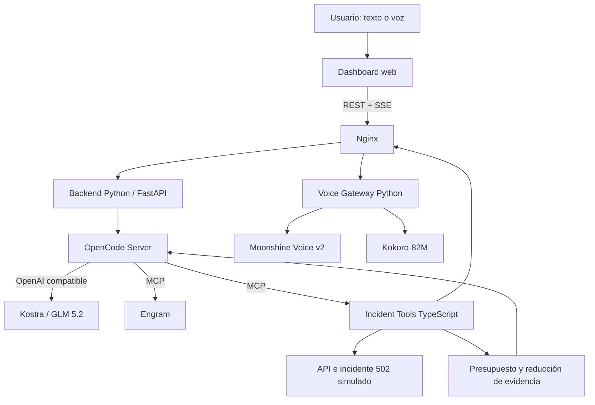

# Research técnico de Vini — IR-Agent

**Fecha:** 3 de septiembre de 2026  
**Track:** Incident Response Agent  
**Repositorio:** [alonso-porcell/hackaton-huawei](https://github.com/alonso-porcell/hackaton-huawei)

## Qué contiene este documento

Este archivo reúne el research técnico inicial de Vini para el proyecto de la hackatón. Su objetivo es dejar una propuesta trazable y discutible sobre:

- el problema que resolverá el agente;
- la arquitectura recomendada;
- el rol de cada tecnología;
- el uso obligatorio de Kostra con `glm-5.2`;
- OpenCode como agente principal;
- Engram como memoria persistente;
- optimización del consumo de tokens;
- interacción gratuita por voz;
- estrategia de pruebas con TDD, pytest, Gherkin, Cucumber.js y Stryker;
- diseño de tareas atómicas para las acciones del agente;
- seguridad, fiabilidad y experiencia de usuario;
- alcance del MVP, riesgos y decisiones pendientes.

Este documento **no pretende reemplazar el research de los demás integrantes**. Otra persona subirá su propio archivo de investigación, por lo que las propuestas deben compararse antes de convertirlas en decisiones definitivas del equipo.

## 1. Resumen ejecutivo

La propuesta es construir **IR-Sentinel**, un agente autónomo de respuesta ante incidentes que reciba una alerta, investigue logs y métricas, formule hipótesis con evidencia, ejecute una mitigación segura y compruebe que el servicio se recuperó.

El núcleo tecnológico propuesto es:

| Responsabilidad | Tecnología |
|---|---|
| Inferencia | Kostra Cloud con `glm-5.2` |
| Agente y orquestación | OpenCode |
| Memoria persistente | Engram mediante MCP |
| Herramientas operativas | Servidor MCP en TypeScript |
| Aplicación y contratos | REST + SSE |
| Optimización de tokens | RTK + compactación de OpenCode + respuestas MCP acotadas |
| Voz a texto | Moonshine Voice v2 |
| Texto a voz | Kokoro-82M |
| Backend e incidente simulado | Python + FastAPI, probado con pytest |
| Frontend y herramientas MCP | TypeScript administrado con pnpm |
| Aceptación ejecutable | Gherkin + Cucumber.js |
| Pruebas de mutación | Stryker sobre los componentes TypeScript |
| Método de desarrollo | TDD + tareas atómicas |
| Punto de entrada | Nginx |
| Ejecución reproducible | Linux + Docker Compose |

La voz y la memoria aportan diferenciación, pero no deben bloquear el recorrido principal. La prioridad es que el agente pueda demostrar de extremo a extremo: **detectar → investigar → decidir → mitigar → verificar → reportar**.

## 2. Problema y escenario recomendado

### Problema

Durante un incidente, la evidencia suele estar distribuida entre alertas, logs, métricas, configuraciones y runbooks. Esto aumenta el tiempo de diagnóstico y facilita decisiones basadas en intuición en lugar de evidencia.

### Escenario para el MVP

Nginx comienza a responder `502 Bad Gateway` porque, después de un cambio de configuración, su upstream apunta a un puerto incorrecto. El backend continúa saludable cuando se consulta directamente.

Este escenario permite demostrar de forma determinista:

1. aumento de errores y alerta;
2. lectura acotada de logs;
3. inspección segura de configuración;
4. comparación con una versión conocida;
5. identificación de causa raíz con evidencias;
6. rollback reversible;
7. recarga controlada de Nginx;
8. verificación de recuperación desde `502` a HTTP `200`;
9. registro del aprendizaje en Engram.

Conviene implementar un incidente principal con mucha calidad antes que varios casos incompletos.

## 3. Alineación con la rúbrica

De acuerdo con las imágenes entregadas durante el evento, la evaluación es:

| Criterio | Peso | Evidencia propuesta para la demo |
|---|---:|---|
| Tareas exitosas/correctas | 30% | El servicio vuelve de `502` a `200` y una prueba confirma la recuperación |
| Comportamiento y autonomía | 25% | OpenCode completa el ciclo de investigación sin instrucciones paso a paso |
| Uso de herramientas y orquestación | 15% | Historial visible de llamadas MCP y sus resultados |
| Gestión de ambigüedad y fallos | 10% | Manejo de logs incompletos y reintento ante una herramienta no disponible |
| Fiabilidad y prevención de alucinaciones | 10% | Cada conclusión referencia evidencia y nivel de confianza |
| UX y calidad de la demostración | 5% | Dashboard con progreso, aprobación, resultado y voz opcional |
| Creatividad | 5% | Memoria de incidentes, presupuesto de tokens e interacción hablada |

> **Nota para coordinación:** el `README.md` actual asigna 25% a herramientas y 20% a ambigüedad, pero la imagen de la rúbrica indica 15% y 10%, además de dos categorías de 10% y dos de 5%. El equipo debería validar los porcentajes oficiales antes de cerrar la presentación.

## 4. Arquitectura propuesta



### Recorrido de una solicitud

1. El usuario escribe o habla desde el navegador.
2. Si usa voz, Moonshine convierte el audio en texto.
3. El backend Python crea o continúa una sesión en OpenCode.
4. OpenCode usa exclusivamente Kostra con `glm-5.2`.
5. El agente consulta Engram para recuperar incidentes similares.
6. OpenCode invoca herramientas MCP para revisar salud, logs, métricas y configuración.
7. El agente presenta causa probable, evidencia, confianza y acción sugerida.
8. Las acciones reversibles autorizadas pueden ejecutarse; las destructivas requieren aprobación.
9. El agente vuelve a medir el servicio antes de afirmar que se recuperó.
10. Engram conserva el resultado y Kokoro puede leer la respuesta en voz alta.

## 5. Decisiones sobre el stack

### 5.1 Kostra y GLM 5.2

Kostra con `glm-5.2` es un requisito fijo. La conexión ya fue configurada y validada desde OpenCode mediante el endpoint:

```text
https://ai.kostra.cloud/v1
```

La clave debe mantenerse como secreto de Docker y nunca incorporarse al repositorio, logs, reportes o memoria. Durante la validación se comprobó además que Kostra rechaza el parámetro no estándar `thinking` para este modelo; la configuración de OpenCode no debe enviarlo.

Antes de la demo debe verificarse específicamente:

- generación normal de texto;
- tool calling con el servidor MCP;
- streaming de eventos;
- comportamiento ante HTTP `401`, `429` y `5xx`;
- consumo real de tokens por ejecución.

### 5.2 OpenCode

OpenCode reemplaza a Hermes como agente central porque ya está conectado con Kostra y ofrece agentes configurables, plugins, servidores MCP y ejecución programática.

Para la interfaz se propone ejecutar `opencode serve`, que expone un servidor HTTP, documentación OpenAPI y eventos globales mediante SSE. El backend TypeScript puede usar el SDK de OpenCode o su API HTTP.

Fuentes:

- [OpenCode Server](https://dev.opencode.ai/docs/server/)
- [Agentes de OpenCode](https://opencode.ai/v2/docs/agents)
- [Servidores MCP en OpenCode](https://opencode.ai/v2/docs/mcp-servers)

### 5.3 Engram

Engram sustituye a Obsidian como memoria persistente. Para este research se considera [`syntax-syndicate/engram-agent-memory`](https://github.com/syntax-syndicate/engram-agent-memory), porque documenta integración directa con OpenCode mediante plugin y MCP.

Engram utilizará SQLite/FTS5 local para guardar:

- incidentes anteriores;
- causas raíz confirmadas;
- mitigaciones exitosas o fallidas;
- decisiones del operador;
- reglas de seguridad;
- contexto útil entre sesiones.

No se debe inyectar toda la memoria en cada prompt. OpenCode solicitará solamente recuerdos relacionados con el servicio, síntoma o error actual. También debe aplicarse sanitización para evitar que un log malicioso se convierta en una instrucción persistente.

### 5.4 REST, SSE y MCP

Las responsabilidades se separan así:

- **REST:** comandos de la aplicación, incidentes, aprobaciones y consultas de estado.
- **SSE:** progreso en vivo, eventos de OpenCode y resultados de herramientas.
- **MCP:** contrato exclusivo entre OpenCode y las herramientas que puede decidir utilizar.

El servidor MCP debería exponer un conjunto pequeño y claro:

| Herramienta | Acción | Riesgo |
|---|---|---|
| `check_health` | Consulta estado y códigos HTTP | Bajo |
| `read_logs` | Recupera logs filtrados y acotados | Bajo |
| `get_metrics` | Obtiene errores, latencia y disponibilidad | Bajo |
| `inspect_config` | Inspecciona configuración con secretos redactados | Bajo |
| `search_memory` | Busca incidentes similares en Engram | Bajo |
| `rollback_config` | Restaura una versión conocida | Medio/reversible |
| `restart_service` | Reinicia un servicio permitido | Medio |
| `verify_recovery` | Comprueba salud y pruebas posteriores | Bajo |

No deben exponerse comandos genéricos como `execute_shell` al modelo para la demo.

### 5.5 Linux, Docker, Nginx, Python y pnpm

Docker Compose debe levantar todos los componentes con un único comando. Nginx será el único puerto público del proyecto y enrutará:

```text
/             → dashboard
/api/*        → backend Python/FastAPI
/opencode/*   → OpenCode Server
/voice/*      → Voice Gateway
```

Para SSE, Nginx debe desactivar el buffering y mantener un tiempo de lectura suficiente. Los servicios internos no necesitan publicarse al host.

La arquitectura será híbrida. Python concentrará la API REST, el simulador del incidente, el procesamiento de voz y su suite de pytest. TypeScript concentrará el dashboard y las herramientas MCP operativas. La lógica de negocio no debe duplicarse entre ambos lenguajes.

`pnpm` se mantiene y administrará exclusivamente los componentes TypeScript:

```text
apps/web
packages/contracts
packages/incident-tools
tests/acceptance
```

El backend Python quedará separado del workspace de pnpm. La herramienta para administrar sus dependencias permanece como una decisión pendiente; no se incorpora una nueva en este research sin acuerdo del equipo.

Engram, Moonshine y Kokoro tienen runtimes propios, pero se ejecutarán como servicios Linux dentro del mismo Compose.

### 5.6 TDD, pytest, Gherkin, Cucumber.js y Stryker

TDD será la metodología de desarrollo para la lógica crítica. Cada comportamiento comenzará con una prueba que falla, continuará con la implementación mínima que la hace pasar y terminará con refactorización protegida por la suite.

Las responsabilidades de prueba se dividirán así:

| Nivel | Herramienta | Alcance |
|---|---|---|
| Unitario e integración Python | [pytest](https://docs.pytest.org/) | API FastAPI, simulación del incidente, voz y reglas implementadas en Python |
| Aceptación | [Gherkin](https://cucumber.io/docs/gherkin/reference/) + [Cucumber.js](https://github.com/cucumber/cucumber-js) | Recorridos completos expresados en lenguaje comprensible para todo el equipo |
| Mutación | [Stryker](https://stryker-mutator.io/) | Calidad de las pruebas del dashboard, herramientas MCP y demás código TypeScript |

Gherkin funcionará como contrato entre perfiles técnicos y no técnicos. Cucumber.js ejecutará solamente los escenarios críticos de extremo a extremo para evitar duplicar toda la suite de pytest.

Stryker se conserva, pero su alcance debe quedar explícito: soporta JavaScript/TypeScript, C# y Scala, no Python. Por ello se aplicará a la capa TypeScript y no reemplazará pytest. Las pruebas de mutación se ejecutarán cuando el flujo principal esté estable, no dentro de cada ciclo rápido de TDD.

Escenarios Gherkin iniciales para `api502`:

1. Nginx responde `502`, pero el backend permanece saludable.
2. El agente identifica el upstream incorrecto y respalda la configuración antes de cambiarla.
3. La recuperación valida Nginx y devuelve el servicio a `200`.
4. Una herramienta falla y el agente continúa con evidencia alternativa o informa el bloqueo.

### 5.7 Tareas atómicas

Cada acción disponible para OpenCode tendrá un único objetivo, entradas explícitas, herramientas autorizadas, salida estructurada, condición de éxito, límite de reintentos y estrategia de reversión cuando corresponda.

El flujo inicial se dividirá en:

```text
observe_incident   → recopilar estado sin modificarlo
diagnose_incident  → producir hipótesis y evidencias
snapshot_config    → respaldar la configuración activa
restore_config     → restaurar una versión conocida
validate_config    → ejecutar la validación de Nginx
reload_proxy       → recargar Nginx de forma controlada
verify_recovery    → comprobar el cambio de 502 a 200
record_incident    → guardar el resultado validado en Engram
```

Esta separación facilita TDD, permisos mínimos, trazabilidad y recuperación ante fallos. Una tarea de diagnóstico no podrá modificar infraestructura y una tarea de recuperación no podrá declarar éxito sin invocar la verificación.

## 6. Optimización de tokens

La optimización debe ser una capacidad visible del producto, no solo una configuración interna.

### Capa 1: RTK

[RTK — Rust Token Killer](https://github.com/rtk-ai/rtk) intercepta comandos de terminal y reduce salidas repetitivas antes de que lleguen al contexto de OpenCode. Tiene integración específica mediante `rtk init -g --opencode`, licencia Apache 2.0 y métricas consultables con `rtk gain`.

RTK es especialmente útil para:

- logs de Docker;
- resultados de pruebas;
- listados de archivos;
- búsquedas con `rg`;
- estado y diferencias de Git.

Sus porcentajes corresponden a reducción de salida de terminal, no necesariamente a reducción equivalente del gasto total del modelo.

### Capa 2: compactación de OpenCode

La [compactación de OpenCode](https://opencode.ai/v2/docs/compaction) reemplaza contexto antiguo por un checkpoint estructurado y conserva una cola reciente. Debe mantenerse activa y probarse con `glm-5.2` antes del evento.

### Capa 3: presupuesto de las herramientas MCP

Cada herramienta operativa aceptará límites como:

```json
{
  "service": "payments-api",
  "since": "10m",
  "severity": ["error", "critical"],
  "max_items": 30,
  "max_chars": 8000
}
```

La respuesta entregará resumen, patrones, conteos y referencias. La evidencia completa permanecerá almacenada y podrá recuperarse bajo demanda por identificador.

### Capa 4: Engram selectivo

Engram devolverá un número pequeño de recuerdos relevantes con metadatos de procedencia, evitando reenviar conversaciones enteras.

### Métricas para la demo

- caracteres/tokens antes de reducir;
- caracteres/tokens enviados a Kostra;
- porcentaje estimado de reducción;
- cantidad de evidencias descartadas como duplicadas;
- cantidad de detalles recuperados bajo demanda;
- latencia añadida por el optimizador.

## 7. Voz local y gratuita

### Voz a texto: Moonshine Voice v2

[Moonshine Voice v2](https://github.com/moonshine-ai/moonshine-v2) es una alternativa reciente diseñada para voz en tiempo real. Procesa localmente, soporta streaming y español, y dispone de modelos pequeños adecuados para equipos sin una GPU potente.

Ventajas para la demo:

- transcripción mientras el usuario habla;
- baja latencia;
- ejecución local sin API key;
- detección de fin de frase;
- soporte multiplataforma.

**Consideración de licencia:** el código es MIT, pero los modelos distintos del inglés —incluido español— utilizan actualmente una licencia comunitaria no comercial. Es apropiado para evaluar en una hackatón, pero debe revisarse si el proyecto continúa comercialmente.

Como alternativa comercialmente permisiva está [NVIDIA Parakeet TDT 0.6B v3](https://huggingface.co/nvidia/parakeet-tdt-0.6b-v3), con español y licencia CC BY 4.0, aunque requiere más memoria y capacidad de cómputo.

### Texto a voz: Kokoro-82M

[Kokoro-FastAPI](https://github.com/remsky/Kokoro-FastAPI) ofrece síntesis en español, endpoint compatible con OpenAI, ejecución en CPU y contenedores preparados. Tanto el wrapper como los pesos de Kokoro se distribuyen bajo Apache 2.0.

### Integración propuesta

```text
Micrófono del navegador
    → Voice Gateway
    → Moonshine v2
    → texto
    → OpenCode/Kostra
    → respuesta textual
    → Kokoro
    → audio reproducido en el navegador
```

La captura debe realizarse en el dashboard web y no dentro del escritorio noVNC, porque el micrófono del host no se transmite automáticamente al contenedor. Siempre debe existir entrada y salida textual como respaldo.

## 8. Seguridad, fiabilidad y UX

### Controles obligatorios

- Redactar secretos antes de mostrar o almacenar resultados.
- Separar herramientas de lectura y escritura.
- Usar una lista cerrada de servicios y acciones permitidas.
- Solicitar aprobación humana para acciones irreversibles o de alto impacto.
- Guardar evidencia antes de ejecutar una mitigación.
- Verificar el estado después de cada cambio.
- No convertir contenido de logs en instrucciones del sistema.
- Registrar herramienta, parámetros seguros, resultado, tiempo y actor.

### Diseño conversacional

El psicólogo del equipo puede diseñar el patrón de comunicación del agente:

1. describir el síntoma observado;
2. diferenciar hechos de hipótesis;
3. indicar evidencia y nivel de confianza;
4. explicar impacto y reversibilidad de la acción;
5. pedir aprobación cuando corresponda;
6. comunicar el resultado sin afirmar éxito antes de verificarlo.

Ejemplo:

> Detecté una discrepancia entre la configuración activa y la última versión estable. Mi confianza es 87%. La evidencia proviene de los eventos `LOG-18`, `CFG-04` y `METRIC-09`. Puedo restaurar la configuración anterior; la acción es reversible y luego ejecutaré una prueba de salud.

## 9. Alcance de implementación

### Obligatorio

- Kostra + `glm-5.2` funcionando desde OpenCode.
- Incidente determinista `api502` con backend Python/FastAPI saludable y upstream Nginx incorrecto.
- Cuatro herramientas de lectura y una mitigación reversible.
- Evidencias y nivel de confianza.
- Verificación posterior.
- Dashboard con eventos en vivo.
- Docker Compose reproducible.
- Medición de reducción de tokens.
- Pruebas Python con pytest desarrolladas mediante TDD.
- Tareas del agente pequeñas, trazables y con permisos explícitos.

### Deseable

- Engram recordando y recuperando un incidente anterior.
- RTK integrado con OpenCode.
- Voz a texto con Moonshine.
- Respuesta hablada con Kokoro.
- Escenarios críticos Gherkin ejecutados con Cucumber.js.
- Stryker aplicado a los componentes TypeScript críticos.

### Fuera del alcance inicial

- Kubernetes real.
- Infraestructura cloud adicional.
- Múltiples agentes autónomos compitiendo.
- Integración con sistemas empresariales reales.
- Acciones destructivas.
- Más de un escenario principal antes de estabilizar el MVP.

## 10. Riesgos y mitigaciones

| Riesgo | Impacto | Mitigación |
|---|---|---|
| GLM 5.2 no ejecuta correctamente alguna herramienta | Alto | Probar tool calling al inicio y simplificar los esquemas MCP |
| La compactación añade parámetros incompatibles | Alto | Validar con Kostra y no enviar `thinking` |
| Demasiados servidores MCP consumen contexto | Alto | Mantener únicamente Engram e Incident Tools durante la demo |
| Los logs saturan el contexto | Alto | Filtros deterministas, paginación, RTK y referencias recuperables |
| Engram guarda información falsa o maliciosa | Medio | Guardar solo conclusiones verificadas y sanitizar entradas |
| Moonshine no rinde bien en el equipo | Medio | Probar modelo pequeño y conservar interfaz textual |
| Licencia del modelo español de Moonshine | Medio | Uso limitado a hackatón; Parakeet como alternativa futura |
| Kokoro pronuncia incorrectamente términos técnicos | Bajo | Diccionario de pronunciación y texto visible |
| Nginx interrumpe SSE | Medio | Desactivar buffering y probar reconexión |
| La arquitectura híbrida duplica lógica | Alto | Asignar responsabilidades exclusivas: Python para API/simulación/voz y TypeScript para dashboard/MCP |
| Stryker se intenta aplicar al código Python | Medio | Limitar explícitamente Stryker a JavaScript/TypeScript y usar pytest para Python |
| Las suites de pytest y Cucumber duplican escenarios | Medio | Reservar Cucumber.js para pocos recorridos end-to-end y pytest para pruebas internas |
| Dependencia de internet para Kostra | Alto | Capturas y resultado de una ejecución previa como respaldo de presentación |

## 11. Pruebas de aceptación

1. El entorno arranca con un único comando.
2. Ningún secreto aparece en Git, logs, Engram o dashboard.
3. OpenCode responde utilizando Kostra y `glm-5.2`.
4. El agente detecta la causa correcta del incidente seleccionado.
5. Cada conclusión importante referencia al menos una evidencia.
6. Una herramienta puede fallar y el agente continúa o explica el bloqueo.
7. La restauración corrige el upstream y cambia el servicio de `502` a `200`.
8. El agente verifica la recuperación antes de cerrar el incidente.
9. Engram recupera un incidente anterior relevante sin cargar toda la memoria.
10. El dashboard muestra tokens antes y después de la reducción.
11. La entrada por texto funciona aunque falle la voz.
12. La demostración completa dura menos de cuatro minutos.
13. pytest valida la lógica Python crítica.
14. Los escenarios Gherkin principales pueden ejecutarse con Cucumber.js.
15. Stryker se ejecuta únicamente sobre componentes TypeScript seleccionados.

## 12. Decisiones pendientes para contrastar con el segundo research

- Confirmar que el Engram elegido por el equipo es `syntax-syndicate/engram-agent-memory` y no otro proyecto con el mismo nombre.
- Medir Moonshine v2 en español con el hardware que se usará en la presentación.
- Decidir si la licencia no comercial de Moonshine es aceptable para la continuidad del proyecto.
- Validar la versión de configuración de OpenCode antes de fijar los parámetros de compactación.
- Medir la ventana de contexto y límites efectivos de `glm-5.2` en Kostra.
- Probar tool calling y SSE con la versión exacta de OpenCode del contenedor.
- Acordar qué acciones puede ejecutar el agente automáticamente.
- Definir la herramienta que administrará las dependencias Python; pnpm se mantiene para TypeScript.
- Elegir el runner unitario TypeScript que utilizará Stryker.
- Definir el umbral de mutation score requerido sin comprometer el tiempo de la hackatón.
- Corregir o confirmar la discrepancia de porcentajes de la rúbrica.
- Definir quién será responsable de la integración final y del guion de demo.

## 13. Conclusión

El stack propuesto es coherente si cada componente tiene una responsabilidad concreta. OpenCode debe concentrar la orquestación; Kostra/GLM 5.2, la inferencia; Engram, la memoria; Python/FastAPI, la API y el incidente simulado; TypeScript con pnpm, el dashboard y las herramientas MCP; RTK y las respuestas MCP acotadas, la eficiencia; Moonshine y Kokoro, la experiencia por voz.

TDD, pytest, Gherkin, Cucumber.js, Stryker y las tareas atómicas forman una estrategia complementaria: pytest protege Python, Stryker evalúa la calidad de las pruebas TypeScript, Gherkin expresa el comportamiento esperado y Cucumber.js verifica unos pocos recorridos completos.

El diferenciador no será solamente hablar con el agente, sino demostrar que puede investigar con autonomía, justificar cada decisión, controlar sus tokens, recordar aprendizajes y comprobar objetivamente que el servicio se recuperó.

